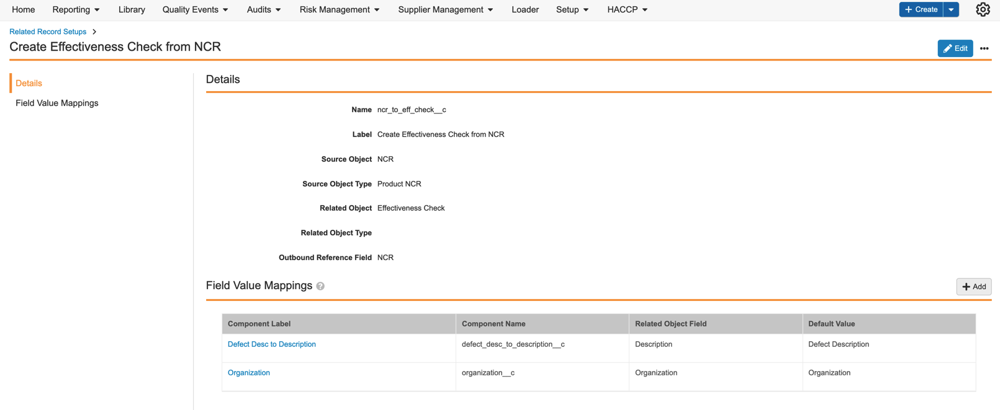

## QualityOne

### QMS

#### Generate Document from Report

This feature enables customers to generate a document from an exported Report directly from a Periodic Review Item as part of a periodic review process, such as APQR. Running this action generates an associated document based on an export of a specified report.

Learn more about [Document Generation](https://qualityone.veevavault.help/en/lr/553724).

#### QualityOne Entry Action: Create Related Record

QualityOne adds a new entry action configuration that will automate creation of related records when the parent record enters in a particular lifecycle state. The **Create Related Record** action will run as an entry action for the admin-configured components available through the Related Record Setup tab. 

Learn more about [setting up related record automation](https://platform.veevavault.help/en/lr/70804).

#### Skip Checklist Assignment for Previously Assigned Checklists

This feature enhances the behavior of the existing _Manual Checklist Assignment_ user action available in the _Audit_ lifecycle. Triggering this action now will skip assigning checklists to previously assigned users in an _Audit Checklist_, avoiding duplicating checklist tasks for the same users and assigning checklists to any newly-added users. This creates more clarity for users working on a checklist and removes any confusion pertaining to duplicate tasks.

Learn more about [audit checklists](https://qualityone.veevavault.help/en/lr/544041).

#### Supporting Multi-Batch Identification for COA

This feature provides Vault with additional capabilities to determine the number of batches in a single COA file during ingestion and analysis. Based on the number of identified batches, Vault will create one (1) _COA Inspection_ record per batch. Identifying multi-batch COA files allows customers to ingest a wider range of COA formats.

Learn more about [analyzing multi-batch COA files](https://qualityone.veevavault.help/en/lr/515322#how_to_analyze_a_coa).

> **Note:** This feature is currently available only to Early Adopters. Contact your Veeva Representative for more information.

#### COA UX Enhancements

This feature adds additional UX improvements to previously delivered features, such as the _Analyze COA_, _Analyze Inspection_, and _Delete Inspection_ actions and job notifications.

Learn more about the UX improvements for [COA analysis](https://qualityone.veevavault.help/en/lr/515322).

> **Note:** This feature is currently available only to Early Adopters. Contact your Veeva Representative for more information.

#### COA Enhancements

This feature adds additional UX improvements to previously delivered features, such as the _Analyze COA_ action and job logging, along with additional minor backend functionality to enhance COA post-processing capabilities.

Learn more about the minor improvements for [COA analysis](https://qualityone.veevavault.help/en/lr/515322#how_to_analyze_a_coa).

> **Note:** This feature is currently available only to Early Adopters. Contact your Veeva Representative for more information.

### Training

#### QualityOne Training Connector: eLearning Data Model Provisioning

This feature extends the existing QualityOne Training Connector with new fields, and an integration and integration point to support E-Learning content synchronization between QualityOne and Training Vault. New fields in the Training Vault capture details from the _E-Learning Source Document_, while the new integration and integration point aids in the transferring of E-Learning content between the two (2) Vaults.

Learn more about the [QualityOne to Training Connection](https://qualityone.veevavault.help/en/lr/549896).

